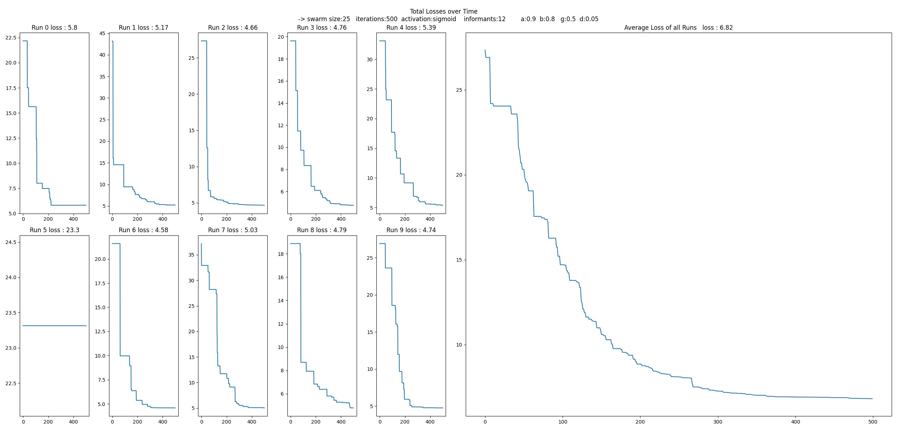
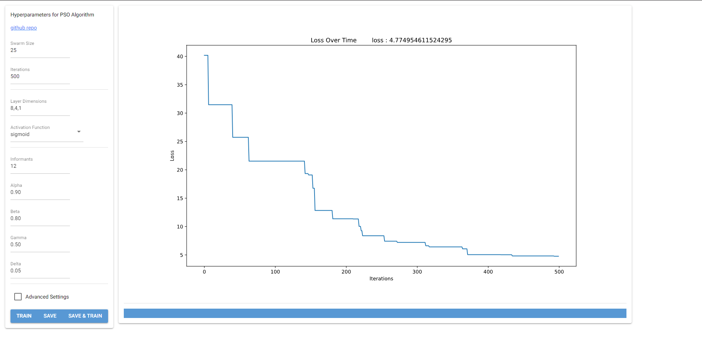

# Biologically Inspired Computation
## Particle Swarm Optimisation
### by Ben Johnston, Walid Dahnn

# Project Introduction 
## Effect of an Artificial Neural Network’s Architecture on its Problem-Solving Ability: 

The architecture of an Artificial Neural Network (ANN) has a significant impact on its performance and ability to solve problems. The architecture of an ANN is made up of the number of layers, the number of neurons in each layer, and the activation function used in each layer. When implementing each of these three aspects of ANN’s architecture, a slight change was observed on the graphs when running the algorithm. Specifically, the number of layers and the number of neurons per layer did not have much observed effect on the graphs, but the algorithm ran slower when any of their numbers increased. For example, most of the experiments were done using a neuron number of (8,4,1). When this was changed to (8,4,3,1), the algorithm took longer to run but the graph remained almost the same. As for the activation functions, sigmoid, ReLU, and tanh, all three functions had similar behaviour in terms of graphs’ shapes and running time when running them with a certain set of parameters. 

## Best Way of Allocating Solution Evaluations in PSO 

In order to determine which way is the best for allocating solution evaluations in a Particle Swarm Optimization (PSO), many experiments were run to find out the combination of swarm size and iteration number that gives the least average loss of runs. When provided with a fixed budget of evaluations (e.g., 500), and during the testing phase, it was concluded that running the algorithm with a high number of either one of swarm size or iterations gave higher averages of loss of runs.  

 

While a small swarm size (e.g., 10) and more iterations (e.g., 50) meant each particle explored the layers better, which could have led to a better convergence, but it limited diversity in the swarm, which may perhaps had caused premature convergence to the local optima. On the contrary, a large swarm (e.g., 50) and fewer iterations (e.g., 10) meant greater diversity in the swarm, but could also have led to insufficient time for proper convergence. [3] [4] 

 

Hence, it is preferrable to use a balanced approach (e.g., swarm size = 20 and iterations = 25) when it comes to choosing a swarm size and an iteration number for the PSO to run with a least average of loss in runs. 

## Effect of Varying Acceleration Coefficients in PSO 

There are four acceleration coefficients that affect the Particle Swarm Optimization (PSO): [5]  

Inertia Weight – alpha: it controls the influence of the previous velocity. [8] 

 

Cognitive Component (Personal Best Influence) – beta: lower values lead to faster convergence but less exploration of particles around their personal best positions, while higher values encourage particles to explore around their personal best positions, which promotes individual exploration. [6] 

 

Informant Component (Informant Best Influence) – gamma: lower values make the overall swarm more cohesive, and vice versa. [9] 

 

Social Component (Global Best Influence) – delta: higher values encourage particles to move towards the global best position, promoting collective convergence, while lower values reduce this influence, allowing more individual exploration. [7] 

# How to use

To run the particle swarm optimiser algorithm simple run
`Experiment.run_experiment_avg()` from the [Experiment](Implementation/Experiment.py) class,
the [main.py](Implementation/main.py) file can be run for quick and easy run with all values setup allready

### parameters include 

hyperparameters file path `hyper_path` (json formatting)

training and testing dataset `train_path` (csv formatting)

saving the outputs `save` True or False

overide [hyperparameters.json](Data/hyperparameters.json) `overide_hp` (json formatting)

# Experiment Outputs

all experiments will be outputed to [Experiments](Experiments) an example of an output would look like this ...

# GUI
there is also a GUI that can be run in the browser for easy single run testing and easy json file editing, just run the
[GUI.py](GUI/GUI.py) script and the browser should load 

